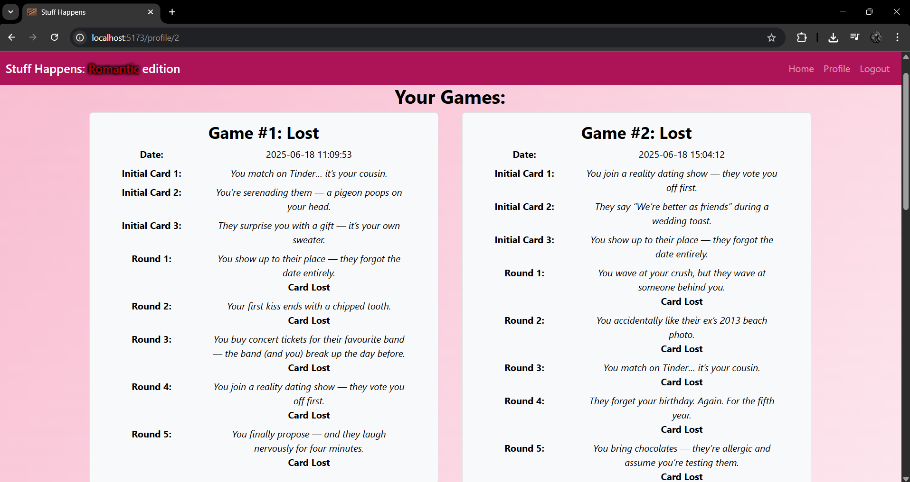
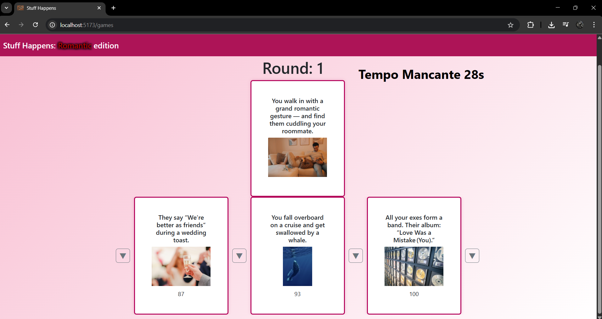

[](https://classroom.github.com/a/uNTgnFHD)
# Exam #1: "Gioco della Sfortuna"
## Student: s346253 Maestrale Sergio

## React Client Application Routes

- Route `/`  
  - Home page: mostra uno schermo di benvenuto, permette all'utente di accedere alla pagina di login, di vedere le istruzioni.
  - se l'utente è loggato può iniziare una partita normale, se no un utente non loggato può iniziare una partita demo.

- Route `/games`  
  - Game Manager: schermata di gioco, mostra le carte in mano, il round e la carta pescata da abbinare, tramite l'uso dei bottoni.

- Route `/games/summary`  
  - Game Summary: mostra un riassunto della partita, dicendo se è stata vinta o meno, e quali carte sono state ottenute in mano.
  - permette di giocare un'altra partita o di ritornare al menu principale.

- Route `/profile/:idProfile`  
  - Profile page: mostra la cronologia delle partite fatte dall'utente, se sono vinte, il nome delle carte che sono state pescate, in quale round e se la carta è stata vinta.

- Route `/login`  
  - Login page: apre un form che permette di fare un login.

- Route `/HowToPlay`  
  - How to play: mostra le istruzioni per come giocare, permette di tornare alla HomePage.

- Route `*`  
  - Not Found: Pagina di errore per indicare una pagina non trovata.

## API Server

- **GET `/api/users/:userId/games`**
  - Request Parameters: `userId` ID numerico dell’utente di cui si vogliono ottenere le partite
  - Response: `200 OK` (success), `400 Bad Request` (userId non valido), `401 Unauthorized` (utente non autenticato), o `500 Internal Server Error` (errore generico).
    - In caso di successo, restituisce un array di partite in formato JSON (vedi esempio sotto).
    - In caso di errore, restituisce un messaggio di errore in formato JSON, ad esempio: `{ "error": "Invalid user ID" }`.
  - Esempio di response:
    ```json
    [
      {
        "gameId": 1,
        "userId": 2,
        "date": "2024-06-19 15:30:00",
        "initialCard1": { "cardId": 1, "name": "Card 1", "image": "image01.jpg", "index": 3 },
        "initialCard2": { ... },
        "initialCard3": { ... },
        "round1": { "roundId": 10, "startedAt": "15:31:00", "card": { ... }, "roundNumber": 1, "won": 1, "gameId": 1 },
        "round2": { ... },
        "round3": { ... },
        "round4": null,
        "round5": null,
        "totalWon": 2
      }
    ]
    ```

- **GET `/api/rounds/:roundNumber/cards`**
  - Request Parameters: `roundNumber` numero del round, `bannedCards` query opzionale (lista di id delle carte da escludere, separati da virgola), `num` query opzionale (numero di carte da pescare), `visibility` query opzionale (se false, nasconde l’indice di sfortuna).
  - Response: `200 OK` (success), `400 Bad Request` (carte già pescate o parametri errati), `500 Internal Server Error` (errore generico).
    - In caso di successo, restituisce un array di carte in formato JSON.
    - In caso di errore, restituisce un messaggio di errore in formato JSON, ad esempio: `{ "error": "Initial cards have already been drawn for this game." }`.
  - Esempio di response:
    ```json
    [
      { "cardId": 1, "name": "Card 1", "image": "image01.jpg", "index": 3 },
      { "cardId": 2, "name": "Card 2", "image": "image02.jpg", "index": 7 }
    ]
    ```

- **GET `/api/rounds/:roundNumber/cards/:cardId`**
  - Request Parameters: `roundNumber` numero del round, `cardId` ID della carta da ottenere
  - Response: `200 OK` (success), `400 Bad Request` (id non valido o carta non pescata in questo round), `404 Not Found` (carta non esistente), o `500 Internal Server Error` (errore generico).
    - In caso di successo, restituisce un oggetto carta in formato JSON.
    - In caso di errore, restituisce un messaggio di errore in formato JSON, ad esempio: `{ "error": "Invalid card ID" }`.
  - Esempio di response:
    ```json
    { "cardId": 1, "name": "Card 1", "image": "image01.jpg", "index": 3 }
    ```

- **POST `/api/games`**
  - Request Body: `{ "userId": 2, "date": "2024-06-19 15:30:00", "totalWon": 2 }`
  - Response: `201 Created` (success), `400 Bad Request` (carte iniziali mancanti o non valide), `401 Unauthorized` (utente non autenticato), `422 Unprocessable Entity` (dati non validi), o `500 Internal Server Error` (errore generico).
    - In caso di successo, restituisce `{ "gameId": 11 }`.
    - In caso di errore, restituisce un messaggio di errore in formato JSON, ad esempio: `{ "error": "Initial cards not found in session or invalid" }`.
  - Esempio di response:
    ```json
    { "gameId": 11 }
    ```

- **PUT `/api/games/:gameId`**
  - Request Parameters: `gameId` ID della partita da aggiornare
  - Request Body: `{ "roundsIds": [21, 22, 23, 24, 25] }`
  - Response: `200 OK` (success), `400 Bad Request` (gameId mancante o non valido), `401 Unauthorized` (utente non autenticato), `422 Unprocessable Entity` (dati non validi), o `500 Internal Server Error` (errore generico).
    - In caso di successo, restituisce `{ "gameId": 11, "roundsIds": [21, 22, 23, 24, 25] }`.
    - In caso di errore, restituisce un messaggio di errore in formato JSON, ad esempio: `{ "error": "Missing or invalid gameId" }`.
  - Esempio di response:
    ```json
    { "gameId": 11, "roundsIds": [21, 22, 23, 24, 25] }
    ```

- **POST `/api/games/:gameId/rounds`**
  - Request Parameters: `gameId` ID della partita
  - Request Body: `{ "rounds": [ { "startedAt": "15:31:00", "roundNumber": 1, "won": true }, ... ] }`
  - Response: `201 Created` (success), `400 Bad Request` (gameId mancante/non valido o carte mancanti in sessione), `401 Unauthorized` (utente non autenticato), `422 Unprocessable Entity` (dati non validi), o `500 Internal Server Error` (errore generico).
    - In caso di successo, restituisce `{ "roundIds": [21, 22] }`.
    - In caso di errore, restituisce un messaggio di errore in formato JSON, ad esempio: `{ "error": "No drawn card found in session for round 1" }`.
  - Esempio di response:
    ```json
    { "roundIds": [21, 22, 23, 24] }
    ```

- **POST `/api/rounds/:roundNumber/timers`**
  - Request Parameters: `roundNumber` numero del round
  - Request Body: `{ "startedAt": "15:31:00" }`
  - Response: `201 Created` (success), `400 Bad Request` (parametri mancanti).
    - In caso di successo, restituisce `{ "message": "Timer saved in session", "roundNumber": "1", "startedAt": "15:31:00" }`.
    - In caso di errore, restituisce un messaggio di errore in formato JSON, ad esempio: `{ "error": "Missing startedAt or roundNumber" }`.
  - Esempio di response:
    ```json
    { "message": "Timer saved in session", "roundNumber": "1", "startedAt": "15:31:00" }
    ```

- **POST `/api/rounds/:roundNumber/timers/validate`**
  - Request Parameters: `roundNumber` numero del round
  - Response: `200 OK` (success), `400 Bad Request` (timer non trovato per questo round).
    - In caso di successo, restituisce `{ "valid": true, "elapsed": 28 }`.
    - In caso di errore, restituisce un messaggio di errore in formato JSON, ad esempio: `{ "error": "No timer found for this round" }`.
  - Esempio di response:
    ```json
    { "valid": true, "elapsed": 28 }
    ```

- **POST `/api/sessions`**
  - Request Body: `{ "username": "user@email.com", "password": "password" }`
  - Response: `200 OK` (success), `401 Unauthorized` (credenziali errate).
    - In caso di successo, restituisce un oggetto utente autenticato.
    - In caso di errore, restituisce un messaggio di errore in formato JSON, ad esempio: `{ "error": "Unauthorized" }`.
  - Esempio di response:
    ```json
    { "id": 1, "name": "Sfortunato03", "email": "romantico01@nomail.com" }
    ```

- **GET `/api/sessions/current`**
  - Response: `200 OK` (success), `401 Unauthorized` (utente non autenticato).
    - In caso di successo, restituisce un oggetto utente autenticato.
    - In caso di errore, restituisce un messaggio di errore in formato JSON, ad esempio: `{ "error": "Not authenticated" }`.
  - Esempio di response:
    ```json
    { "id": 1, "name": "Sfortunato03", "email": "romantico01@nomail.com" }
    ```

- **DELETE `/api/sessions/current`**
  - Response: `200 OK` (success).
    - In caso di successo, restituisce una risposta vuota.
    - In caso di errore, restituisce un messaggio di errore in formato JSON, ad esempio: `{ "error": "Not authenticated" }`.

## Database Tables

- Table `users` - contiene un `id_user` auto-incrementale, `email` univoca, `name`, infine `hash` e `salt` per criptare la password.
- Table `cards` - contiene `id_card` auto-incrementale, `name` della situazione orribile, `image` che indica il path dell'immagine, `unluck_index` che indica l'indice di sfortuna della carta. 
- Table `games` - contiene `id_games` autoincrementale, `id_player` per indicare l'user che ha fatto la partita, le tre carte iniziali (`initial_cards1`, `initial_cards2`, `initial_cards3`), `date` che indica la data di gioco, l'id dei round giocati, se no null (`round1`, `round2`, `round3`, `round4`, `round5`) e `total_won` indica quante carte sono state vinte.
- Table `rounds` - contiene `id_round` autoincrementale, `started_at` che indica quando il round è stato iniziato, `id_card` della carta pescata quel round, `round_number` che è il numero del round, `won` 0 se il round è stato perso 1 se round è stato vinto, e `id_game` per indicare a quale game appartiene.
- 

## Main React Components

- `NavHeader` (in `NavHeader.js`):  
  Purpose: Barra di navigazione superiore, mostra i link per Home e il bottone di login/logout.  
  Main Functionality: Visualizza una interstizione con il nome della pagina, contiene link per fare login/logout, i link vengono disabilitati durante il gioco.

- `HomePage` (in `HomePage.js`):  
  Purpose: Schermata di benvenuto, permette di iniziare una partita o vedere le istruzioni.  
  Main Functionality: Mostra il titolo, permette di iniziare una partita normale o demo, a seconda l'utente sia loggato o meno, link alle istruzioni di gioco, quando una partita è iniziata imposta come inutilizzabili i link del NavHeader, e chiama l'inizializzazione alla partita.

- `GameManager` (in `GameManager.js`):  
  Purpose: Gestisce la logica e l’interfaccia della partita, a fine partita si occupa di passare a server i dati per essere salvati (in caso di utente loggato).  
  Main Functionality: Riceve i dati iniziali per una partita, ne gestisce i round, la selezione delle carte e il flusso di gioco, mostra le carte in mano e la carta pescata, fa chiamate per gestire il timer, si occupa di renderizzare questi elementi e di fare le chiamate al Server per validare il timer, estrarre le nuove carte, e per il salvataggio dei dati a fine partita.

- `GameCard` (in `GameCard.js`):  
  Purpose: Visualizza una singola carta con nome, immagine e indice di sfortuna.  
  Main Functionality: Gestisce i dettagli della renderizzazione della carta, usando il componente react Card.

- `Timer` (in `Timer.js`):  
  Purpose: Mostra un timer visibile per il round corrente.  
  Main Functionality: Visualizza il countdown in secondi, chiama una funzione di timeout quando il tempo scade, usato per far finire un round dal GameManager.

- `GameSummary` (in `GameSummary.js`):  
  Purpose: Mostra un riepilogo della partita appena finita.  
  Main Functionality: Visualizza le carte vinte, mostra se la partita è stata vinta o meno, riabilita i link del NavHeader, fornisce link per tornare alla home page o per iniziare una nuova partita.

- `Profile` (in `Profile.js`):  
  Purpose: Mostra la cronologia delle partite dell’utente e i dettagli di ogni round.  
  Main Functionality: Recupera e visualizza tutte le partite giocate dall’utente, indica se sono vinte o meno e mostra il loro ID come numero, in ordine cronologico crescente, da sinistra verso destra e dall'alto verso il basso, i dettagli mostrati includono, la data della partita, con l'orario, i nomi delle carte iniziali, i nomi delle carte associate al round in cui sono state pescate e se quella carta è stata vinta o persa.

- `HowToPlay` (in `HowToPlay.js`):  
  Purpose: Mostra le istruzioni su come giocare.  
  Main Functionality: Visualizza le regole e i suggerimenti per il gioco, bottone per tornare alla home page.

- `AuthComponents` (in `AuthComponents.js`):  
  Purpose: Gestisce il login e il logout dell’utente.  
  Main Functionality: Form di login con validazione, bottone di logout che termina la sessione e reindirizza alla home.

- `NotFound` (in `NotFound.js`):  
  Purpose: Pagina di fallback per route non definite.  
  Main Functionality: Mostra un messaggio di errore, ritorno alla home è gestito dalla NavBar.

## Screenshot





## Users Credentials

- romantico01@nomail.com, sfortuna33 
- aromantica94@nomail.com, fortuna07
