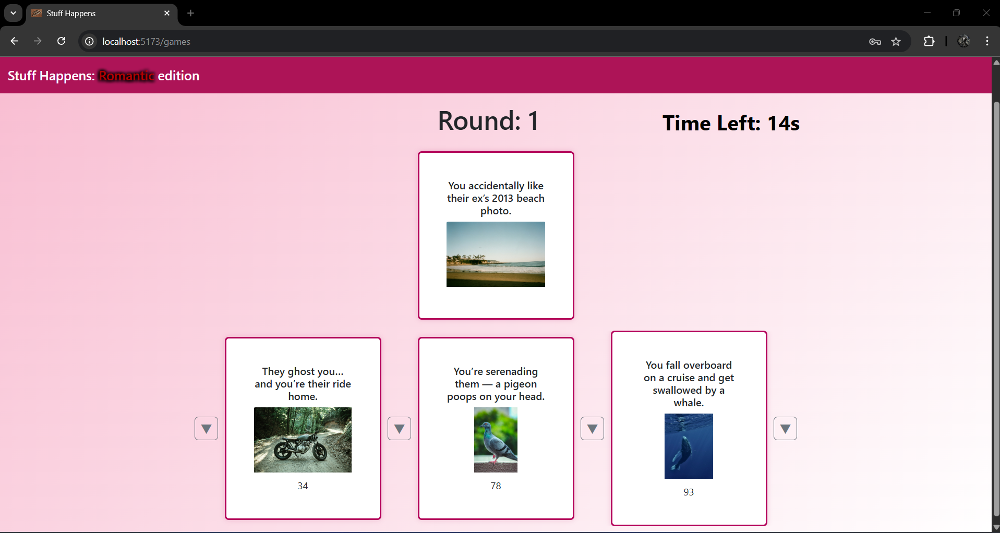

# Exam #1: "Game of Misfortune"

## Installation and Setup

To start the application, follow these steps:

### Client Setup
1. Open a terminal and navigate to the `client` folder:
   ```bash
   cd client
   ```
2. Install dependencies:
   ```bash
   npm install
   ```
3. Start the client in development mode:
   ```bash
   npm run dev
   ```

### Server Setup
1. Open a new terminal and navigate to the `server` folder:
   ```bash
   cd server
   ```
2. Install dependencies:
   ```bash
   npm install
   ```
3. Start the server:
   ```bash
   nodemon index.mjs
   ```

The client application will be available at `http://localhost:5173` and the API server at `http://localhost:3001`.

## React Client Application Routes

- Route `/`  
  - Home page: shows a welcome screen, allows users to access the login page, view instructions.
  - If the user is logged in, they can start a normal game; if not, a non-logged user can start a demo game.

- Route `/games`  
  - Game Manager: game screen, shows cards in hand, the round, and the drawn card to match, using buttons.

- Route `/games/summary`  
  - Game Summary: shows a game summary, indicating whether it was won or not, and which cards were obtained in hand.
  - Allows playing another game or returning to the main menu.

- Route `/profile/:idProfile`  
  - Profile page: shows the user's game history, whether they are won, the names of cards that were drawn, in which round, and if the card was won.

- Route `/login`  
  - Login page: opens a form that allows login.

- Route `/HowToPlay`  
  - How to play: shows instructions on how to play, allows returning to the HomePage.

- Route `*`  
  - Not Found: Error page to indicate a page not found.

## API Server

- **GET `/api/users/:userId/games`**
  - Request Parameters: `userId` Numeric ID of the user whose games you want to retrieve
  - Response: `200 OK` (success), `400 Bad Request` (invalid userId), `401 Unauthorized` (user not authenticated), or `500 Internal Server Error` (generic error).
    - On success, returns an array of games in JSON format (see example below).
    - On error, returns an error message in JSON format, for example: `{ "error": "Invalid user ID" }`.
  - Response example:
    ```json
    [
      {
        "gameId": 1,
        "userId": 2,
        "date": "2024-06-19 15:30:00",
        "initialCard1": { "cardId": 1, "name": "Card 1", "image": "image01.jpg", "index": 3 },
        "initialCard2": { ... },
        "initialCard3": { ... },
        "round1": { "roundId": 10, "startedAt": "15:31:00", "card": { ... }, "roundNumber": 1, "won": 1, "gameId": 1 },
        "round2": { ... },
        "round3": { ... },
        "round4": null,
        "round5": null,
        "totalWon": 2
      }
    ]
    ```

- **GET `/api/rounds/:roundNumber/cards`**
  - Request Parameters: `roundNumber` round number, `bannedCards` optional query (list of card IDs to exclude, comma-separated), `num` optional query (number of cards to draw), `visibility` optional query (if false, hides the misfortune index).
  - Response: `200 OK` (success), `400 Bad Request` (cards already drawn or incorrect parameters), `500 Internal Server Error` (generic error).
    - On success, returns an array of cards in JSON format.
    - On error, returns an error message in JSON format, for example: `{ "error": "Initial cards have already been drawn for this game." }`.
  - Response example:
    ```json
    [
      { "cardId": 1, "name": "Card 1", "image": "image01.jpg", "index": 3 },
      { "cardId": 2, "name": "Card 2", "image": "image02.jpg", "index": 7 }
    ]
    ```

- **GET `/api/rounds/:roundNumber/cards/:cardId`**
  - Request Parameters: `roundNumber` round number, `cardId` ID of the card to retrieve
  - Response: `200 OK` (success), `400 Bad Request` (invalid ID or card not drawn in this round), `404 Not Found` (card doesn't exist), or `500 Internal Server Error` (generic error).
    - On success, returns a card object in JSON format.
    - On error, returns an error message in JSON format, for example: `{ "error": "Invalid card ID" }`.
  - Response example:
    ```json
    { "cardId": 1, "name": "Card 1", "image": "image01.jpg", "index": 3 }
    ```

- **POST `/api/games`**
  - Request Body: `{ "userId": 2, "date": "2024-06-19 15:30:00", "totalWon": 2 }`
  - Response: `201 Created` (success), `400 Bad Request` (missing or invalid initial cards), `401 Unauthorized` (user not authenticated), `422 Unprocessable Entity` (invalid data), or `500 Internal Server Error` (generic error).
    - On success, returns `{ "gameId": 11 }`.
    - On error, returns an error message in JSON format, for example: `{ "error": "Initial cards not found in session or invalid" }`.
  - Response example:
    ```json
    { "gameId": 11 }
    ```

- **PATCH `/api/games/:gameId`**
  - Request Parameters: `gameId` ID of the game to update
  - Request Body: `{ "roundsIds": [21, 22, 23, 24, 25] }`
  - Response: `200 OK` (success), `400 Bad Request` (missing or invalid gameId), `401 Unauthorized` (user not authenticated), `404 Not Found` (game not found), `422 Unprocessable Entity` (invalid data), or `500 Internal Server Error` (generic error).
    - On success, returns `{ "gameId": 11, "roundsIds": [21, 22, 23, 24, 25] }`.
    - On error, returns an error message in JSON format, for example: `{ "error": "Game not found" }`.
  - Response example:
    ```json
    { "gameId": 11, "roundsIds": [21, 22, 23, 24, 25] }
    ```

- **POST `/api/games/:gameId/rounds`**
  - Request Parameters: `gameId` game ID
  - Request Body: `{ "rounds": [ { "startedAt": "15:31:00", "roundNumber": 1, "won": true }, ... ] }`
  - Response: `201 Created` (success), `400 Bad Request` (missing/invalid gameId or missing cards in session), `401 Unauthorized` (user not authenticated), `422 Unprocessable Entity` (invalid data), or `500 Internal Server Error` (generic error).
    - On success, returns `{ "roundIds": [21, 22, 23] }`.
    - On error, returns an error message in JSON format, for example: `{ "error": "No drawn card found in session for round 1" }`.
  - Response example:
    ```json
    { "roundIds": [21, 22, 23] }
    ```

- **POST `/api/rounds/:roundNumber/timers`**
  - Request Parameters: `roundNumber` round number
  - Request Body: `{ "startedAt": "15:31:00" }`
  - Response: `201 Created` (success), `400 Bad Request` (missing parameters).
    - On success, returns `{ "message": "Timer saved in session", "roundNumber": "1", "startedAt": "15:31:00" }`.
    - On error, returns an error message in JSON format, for example: `{ "error": "Missing startedAt or roundNumber" }`.
  - Response example:
    ```json
    { "message": "Timer saved in session", "roundNumber": "1", "startedAt": "15:31:00" }
    ```

- **GET `/api/rounds/:roundNumber/timers/validate`**
  - Request Parameters: `roundNumber` round number
  - Response: `200 OK` (success), `400 Bad Request` (timer not found for this round).
    - On success, returns `{ "valid": true, "elapsed": 28 }`.
    - On error, returns an error message in JSON format, for example: `{ "error": "No timer found for this round" }`.
  - Response example:
    ```json
    { "valid": true, "elapsed": 28 }
    ```

- **POST `/api/sessions`**
  - Request Body: `{ "username": "user@email.com", "password": "password" }`
  - Response: `200 OK` (success), `401 Unauthorized` (incorrect credentials).
    - On success, returns an authenticated user object.
    - On error, returns an error message in JSON format, for example: `{ "error": "Unauthorized" }`.
  - Response example:
    ```json
    { "id": 1, "name": "Sfortunato03", "email": "romantico01@nomail.com" }
    ```

- **GET `/api/sessions/current`**
  - Response: `200 OK` (success), `401 Unauthorized` (user not authenticated).
    - On success, returns an authenticated user object.
    - On error, returns an error message in JSON format, for example: `{ "error": "Not authenticated" }`.
  - Response example:
    ```json
    { "id": 1, "name": "Sfortunato03", "email": "romantico01@nomail.com" }
    ```

- **DELETE `/api/sessions/current`**
  - Response: `200 OK` (success).
    - On success, returns an empty response.
    - On error, returns an error message in JSON format, for example: `{ "error": "Not authenticated" }`.

## Database Tables

- Table `users` - contains an auto-incremental `id_user`, unique `email`, `name`, and `hash` and `salt` to encrypt the password.
- Table `cards` - contains auto-incremental `id_card`, `name` of the horrible situation, `image` indicating the image path, `unluck_index` indicating the card's misfortune index.
- Table `games` - contains auto-incremental `id_game`, `id_player` to indicate the user who played the game, the three initial cards (`initial_card1`, `initial_card2`, `initial_card3`), `date` indicating the game date, the IDs of played rounds, or null (`round1`, `round2`, `round3`, `round4`, `round5`) and `total_won` indicates how many cards were won.
- Table `rounds` - contains auto-incremental `id_round`, `started_at` indicating when the round was started, `id_card` of the card drawn that round, `round_number` which is the round number, `won` 0 if the round was lost 1 if round was won, and `id_game` to indicate which game it belongs to.

## Main React Components

- `NavHeader` (in `NavHeader.js`):  
  Purpose: Top navigation bar, shows links for Home and login/logout button.  
  Main Functionality: Displays an interface with the page name, contains links for login/logout, links are disabled during the game.

- `HomePage` (in `HomePage.js`):  
  Purpose: Welcome screen, allows starting a game or viewing instructions.  
  Main Functionality: Shows the title, allows starting a normal or demo game, depending on whether the user is logged in or not, link to game instructions, when a game is started sets NavHeader links as unusable, and calls game initialization.

- `GameManager` (in `GameManager.js`):  
  Purpose: Manages the game logic and interface, at the end of the game handles passing data to the server to be saved (in case of logged user).  
  Main Functionality: Receives initial data for a game, manages rounds, card selection and game flow, shows cards in hand and the drawn card, makes calls to manage the timer, handles rendering these elements and making calls to the Server to validate the timer, draw new cards, and save data at the end of the game.

- `GameCard` (in `GameCard.js`):  
  Purpose: Displays a single card with name, image, and misfortune index.  
  Main Functionality: Manages card rendering details, using the react Card component.

- `Timer` (in `Timer.js`):  
  Purpose: Shows a visible timer for the current round.  
  Main Functionality: Displays the countdown in seconds, calls a timeout function when time expires, used to end a round from the GameManager.

- `GameSummary` (in `GameSummary.js`):  
  Purpose: Shows a summary of the just-finished game.  
  Main Functionality: Displays won cards, shows whether the game was won or not, re-enables NavHeader links, provides links to return to the home page or start a new game.

- `Profile` (in `Profile.js`):  
  Purpose: Shows the user's game history and details of each round.  
  Main Functionality: Retrieves and displays all games played by the user, indicates whether they are won or not and shows their ID as a number, in increasing chronological order, from left to right and top to bottom, displayed details include, the game date, with time, the names of initial cards, the names of cards associated with the round in which they were drawn and whether that card was won or lost.

- `HowToPlay` (in `HowToPlay.js`):  
  Purpose: Shows instructions on how to play.  
  Main Functionality: Displays rules and suggestions for the game, button to return to the home page.

- `AuthComponents` (in `AuthComponents.js`):  
  Purpose: Manages user login and logout.  
  Main Functionality: Login form with validation, logout button that ends the session and redirects to home.

- `NotFound` (in `NotFound.js`):  
  Purpose: Fallback page for undefined routes.  
  Main Functionality: Shows an error message, return to home is handled by the NavBar.

## Screenshot




## Users Credentials

- romantico01@nomail.com, sfortuna33 
- aromantica94@nomail.com, fortuna07

## Dependencies

For detailed information about project dependencies, see [DEPENDENCIES.md](./DEPENDENCIES.md)
